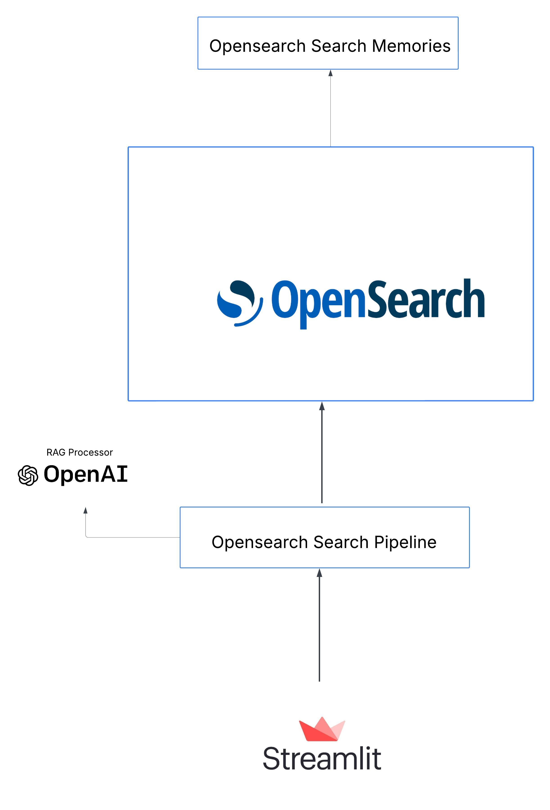
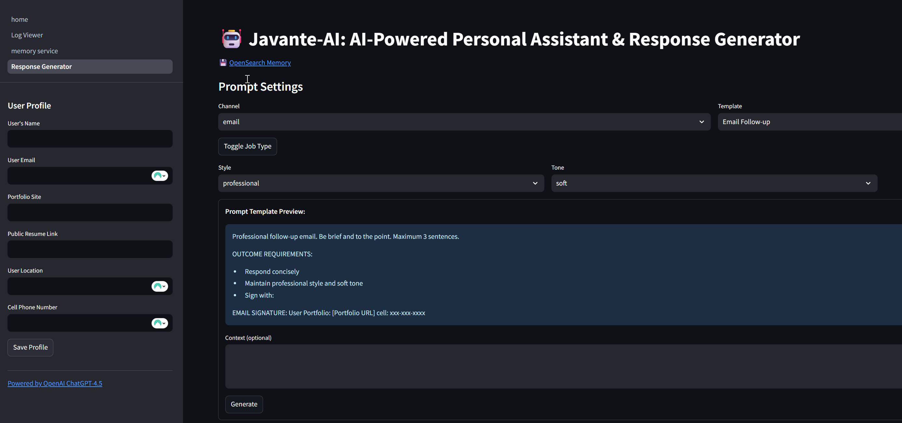

# 🤖 JavanteAI – Your Business AI Personal Assistant

## 🎯 Overview

**JavanteAI** is your executive AI assistant, built for the modern business professional. Whether you're handling recruiter emails, client messages, LinkedIn DMs, or internal Slack chats, JavanteAI empowers you to:

* Respond quickly with intelligent, context-aware replies.
* Maintain a sharp, consistent professional tone.
* Seamlessly blend personal branding with AI precision.

With advanced memory handling, OpenSearch vector search, and GPT-4o generation, JavanteAI efficiently manages your business communication—allowing you to focus on strategic tasks rather than routine responses.

> 💼 Smart. Fast. Unapologetically efficient. JavanteAI brings real executive energy to your inbox.

---

## 🧾 Motivation

In today's fast-paced business environment, professionals receive overwhelming volumes of communication across various channels. JavanteAI empowers organizations and individuals to respond swiftly, intelligently, and personally—without compromising quality or privacy. Utilizing sophisticated AI-driven workflows, JavanteAI enables users to:

* Generate context-aware, tailored responses instantly.
* Ensure consistent, professional tone across all communications.
* Integrate business data and personal branding effectively.

---

## 📦 Technical Architecture




```plaintext
Streamlit UI
   │
   ▼
OpenSearch Vector Search
   │
   ▼
retrieval_augmented_generation Processor
   ├── Retrieves context via OpenSearch Memory APIs
   └── Generates answers using OpenAI GPT-4o connector
   └── Stores responses in OpenSearch (Long-Term Memory)
```

---

## 🎥 Demo (opens on Vimeo)

[](https://vimeo.com/1099817436/8a8c06d306?ts=0&share=copy "Watch the demo on Vimeo")

---

## 🚀 Key Capabilities

### 📌 Semantic Search & Retrieval-Augmented Generation (RAG)

* Utilizes OpenSearch's native RAG processor.
* Employs pure vector search.
* Provides concise, context-aware answers via OpenAI GPT-4o.

### 📌 Intelligent Communication Generation

* Tailored responses for email, Slack, LinkedIn, and customer interactions.
* Secure runtime management of OpenAI API keys.

### 📌 OpenSearch Memory Integration

* Employs OpenSearch ML Commons Memory APIs for storing and retrieving long-term conversational context.
* Enables retrieval of relevant past interactions to enrich responses and maintain conversational coherence.
* Facilitates context-aware and continuous conversations across multiple interactions.

---

## 🛠 Deployment & Stack

* **Docker Compose** for simplified deployment.
* **OpenSearch** for vector search, long-term memory, and RAG processing.
* **OpenAI GPT-4o** for response generation.

---

## 📚 Documentation & Resources

* [OpenSearch RAG Processor](https://docs.opensearch.org/docs/latest/search-plugins/search-pipelines/rag-processor/)
* [OpenSearch Memory APIs](https://docs.opensearch.org/docs/latest/ml-commons-plugin/api/memory-apis/index/)
* [OpenSearch Conversational Search](https://docs.opensearch.org/docs/latest/vector-search/ai-search/conversational-search/)

---

## ✅ Future Enhancements

* Slack and email integrations
* Document uploads with automated OCR
* Admin interface for memory management

---

## 📄 License

MIT License

---

Built for secure, private, and robust business operations.
